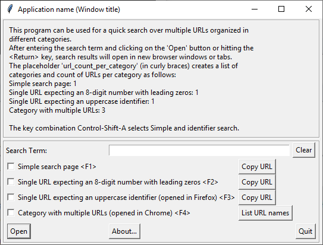

# Search helper

Python script using a Tk GUI for opening predefined search URLs in the web browser.

## Prerequisites

* Requires Python 3.6 or greater.
* PyYAML is required for YAML configuration file parsing.

## Invocation

Choose the configuration file via a dialog:
```
python3 searchhelper.py
```

Use a YAML configuration file (preferred, but requires PyYAML to be installed):
```
python3 searchhelper.py configfile.yaml
```

Use a JSON configuration file
```
python3 searchhelper.py configfile.json
```

## User interface



When you have entered a search string, you can open it in the selected
category or categories using the "Open" button or the **Return** key. This will
open the URLs of each category in webbrowser tabs.
If possible, each category is opened in a separate browser window.

The first up to 12 category selections can be toggled using the function keys
as displayed (**F1** through **F12** from top down).

Pressing **Escape** or clicking the "Quit" button exits the program.

You can delete the search term by pressing **Control-D** or by clicking
the "Clear" button. **Control-X** will copy the search term to the clipboard
and then clear the search term entry field.

For single-URL categories, the "Copy URL" button will copy the URL
generated from the search term to the clipboard.

Categories with multiple URLs have a "List URL names" button instead.
Clicking on that button will present a list of all URL names/identifiers
belonging to that category in a popup window.

Other key combinations selecting multiple categories can be configured
in the configuration files. For details, please follow the link below.

## Configuration files

The configuration file can be in YAML or JSON format.
It contains a data structure as described in
[config\_file\_structure.md](./config_file_structure.md).

The [configfile.py script](./configfile_script.md) can be used to compare configuration files
or to convert a YAML configuration file to a JSON configuration file.
Additionally, it is imported by the main script to load the files.

